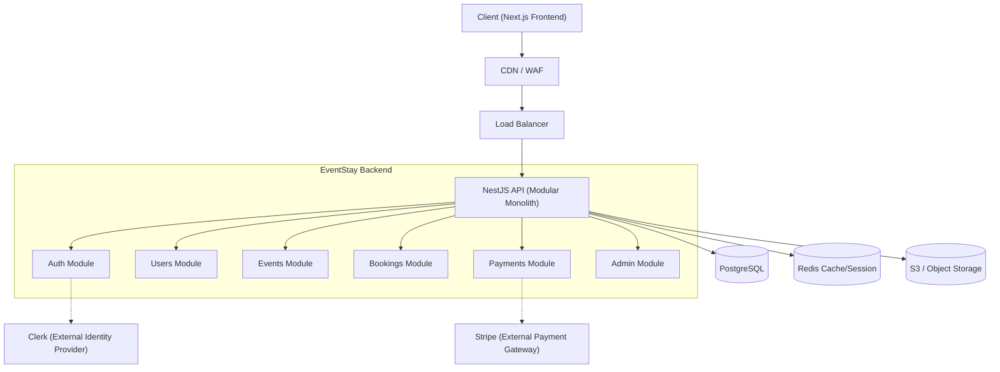

# EventStay System Design & Architecture

## 1. Overall Architecture
EventStay is architected as a **Modular Monolith**. This ensures that the codebase remains highly cohesive, easy to deploy, and simple to maintain while guaranteeing that domain logic is properly segregated into modules.

## 2. Why Modular Monolith
A modular monolith provides the simplest operational overhead while establishing strict boundaries between domains (Events, Venues, Stays, Bookings). By avoiding premature microservices, we sidestep distributed systems complexity (network latency, distributed transactions, tracing) while retaining the ability to extract highly cohesive modules into microservices later if performance or organizational scale demands it.

## 3. Technology Choices
- **Node.js & NestJS**: Highly opinionated enterprise framework providing dependency injection, decorators, and a modular architecture out of the box.
- **PostgreSQL**: Primary transactional database offering robust relational integrity, crucial for booking and inventory management.
- **Prisma ORM**: Type-safe database access to accelerate development and provide a source of truth for the data schema.
- **Redis**: Key-value store intended for future caching, session management, and rate-limiting.
- **Clerk**: Production-grade identity management to handle secure authentication, 2FA, and user sessions without custom logic.

## 4. Module Boundaries
The backend is organized into domain-specific modules:
- **Auth**: Validation of incoming Clerk JWTs and role-based access control.
- **Users**: User profiles, preferences, and host vs. guest definitions.
- **Events**: Core domain handling microsite logic, event scheduling, and grouping.
- **Venues / Stays**: Physical inventory representing where events happen and where guests sleep.
- **Bookings**: The transactional domain linking Users to Stays/Events, tracking inventory limits.
- **Payments**: Financial domain for handling checkout sessions and webhooks.
- **Reviews**: Guest feedback and ratings for events and venues.
- **Media**: Secure upload and retrieval of images/videos using object storage.
- **Notifications**: Email, SMS, and push notifications for bookings and reminders.
- **Search**: Discovery of events and venues.
- **Admin**: Back-office operations, reporting, and global configuration.
- **Common**: Shared utilities, decorators, and filters.
- **Database / Config**: Prisma integration and environment validation.

## 5. Authentication Decision
We selected **Clerk** as the authentication provider. It eliminates the security risks of implementing custom passwords and session cookies, offers drop-in UI components for the frontend, and issues signed JWTs that our NestJS API can verify via the `Auth` module using Passport-JWT or custom guards.

## 6. Future Scalability Direction
As EventStay scales, the modular structure allows us to:
1. Extract the `Search` module into a microservice backed by ElasticSearch/Meilisearch.
2. Spin up a background worker process for the `Notifications` and `Payments` modules using Redis/BullMQ to handle high-throughput, async events off the main thread.
3. Decouple database reads vs. writes using read replicas.
