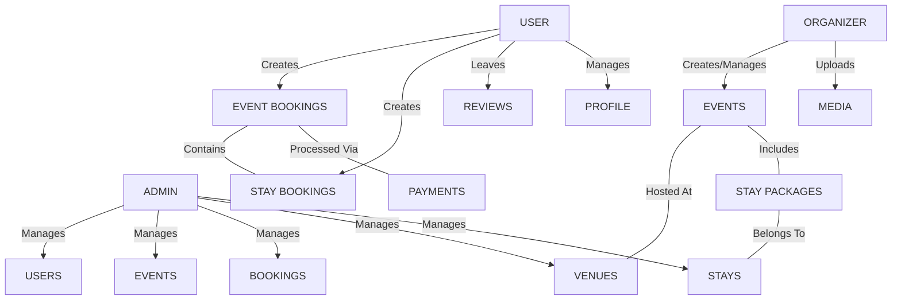

# EventStay - Domain Model

Based on the current project audit (Frontend UI and existing Backend Prisma schema), the actual supported domains map out as follows:



## Supported Domains

### USER
- **Profile**: Basic user details, synced via Clerk.
- **Bookings**: Unified booking interface. A single booking reference that encapsulates Event attendance and optional Stay packages.
- **Reviews**: Feedback for Events or Stays.

### ORGANIZER
- **Events**: Creation, management, capacity tracking, and publishing.
- **Media**: Uploading images/assets for events.

### ADMIN
- **Platform Management**: System-wide oversight.
- **Venues**: Management of physical venues.
- **Stays**: Management of accommodations/hotels that can be bundled into events.

### TRAVEL & FLIGHTS (Not Implemented)
- **Status**: Conceptual / Marketing Only.
- As confirmed by the frontend audit, there is no Flight Search or Flight Booking UI implemented. Flights are handled as off-platform "Concierge Services". Therefore, there is no domain modeled for flights at this stage.

## Unified Booking Architecture
The booking system is centered around the `Event`.
A single `Booking` represents a user's RSVP/Ticket to an `Event`.
Because the frontend demonstrates purchasing specific rooms (e.g., "Sea View Room"), the schema must be updated so a `Booking` can optionally include a `StayPackage` or `Room` reservation.

```text
Booking
 ├── EventBooking (Base attendee record)
 └── StayBooking (Optional room package selection)
```
